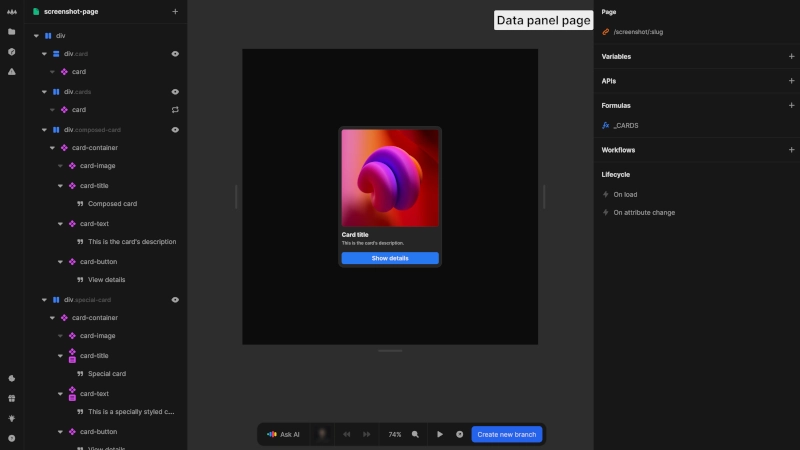
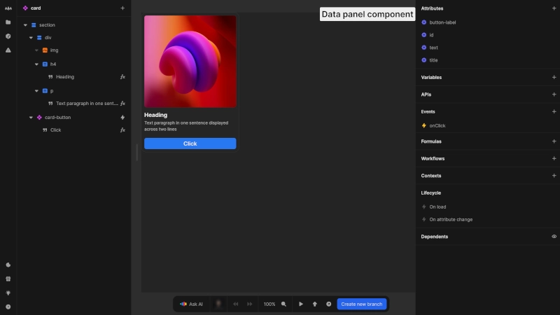

# Data panel
The data panel is the central hub for managing all data aspects of your pages and components in toddle. It allows you to define variables, connect to APIs, create formulas, and establish workflows that power your application's functionality.

{https://toddle.dev/projects/docs_examples/branches/main/components/screenshot-page?leftpanel=design&rightpanel=style&canvas-width=800&canvas-height=800}

{https://toddle.dev/projects/docs_examples/branches/main/components/card?leftpanel=design&rightpanel=style&canvas-width=800&canvas-height=800}

::: info
The data panel is only visible when no element is selected. Press [kbd]Escape[kbd] or click on the background outside the canvas to deselect.
:::

# Data sections
Pages and components have several data sections that provide essential functionality.

## Page
This section appears only for pages, not for components. Configure how your page appears in browsers and search results by setting the URL, title, description, and other metadata.

## Attributes
This section appears only for components, not for pages. Define the interface for your component by creating attributes that can be set when using the component. You can set test values to preview how the component behaves in the editor.

::: info
These attributes are the attributes of your exported web component.
:::

## Variables
Store and manage state within your page or component. Variables can be initialized with default values, updated through actions or workflows, and used in formulas, e.g. to display dynamic content.

## APIs
Connect your application to external services and data sources by defining endpoints, configuring request parameters and handling responses.

## Events
Enable components to communicate with parent elements through custom events that can be triggered by internal actions and pass data upward.

## Formulas
Create reusable calculations and data transformations using toddle's formula syntax to access data from variables, formulas and API responses.

## Workflows
Build multi-step processes to handle complex interactions by combining workflows and actions in sequence with conditional logic.

## Contexts
Subscribe to formulas and workflows exposed by parent components to access functionality while maintaining clean separation of concerns.

## Lifecycle
Control what happens at specific moments in your component or page lifecycle:
- On load: Actions that execute when the page or component is initially loaded
- On attribute change: Actions that run when URL parameters (for pages) or attributes (for components) are modified

## Dependents
View all components that rely on the current component to track usage throughout your project and assess the impact of potential changes.

# Using the data panel effectively
The data panel is fundamental to creating dynamic applications in toddle:
- Define your data model using variables and APIs
- Create formulas to transform and present your data
- Implement workflows to handle user interactions
- Configure lifecycle actions to initialize your application state
- Set up proper communication between components using events and contexts