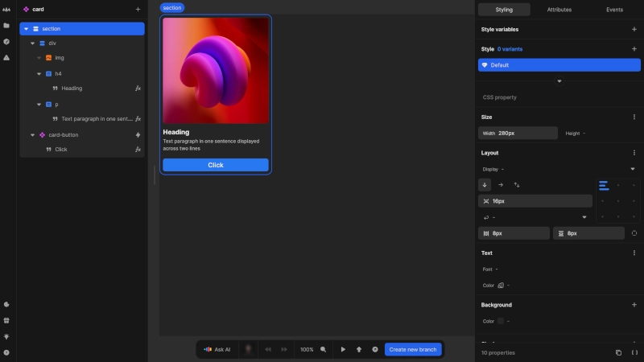

# Styles and layout
The styling and layout system is based on CSS, presenting familiar properties in an intuitive UI panel. This approach lets you style elements visually without writing code while preserving traditional CSS flexibility. For more precise control, the CSS editor is available.

## Styling with the UI panel

{https://toddle.dev/projects/docs_examples/branches/main/components/card?selection=nodes.root&rightpanel=style&canvas-width=800&canvas-height=800}

The UI panel provides a user-friendly interface for applying styles without needing to write CSS directly:
- Properties are logically grouped by categories (**Size**, **Layout**, **Text**, etc.)
- Appropriate controls for each property (color pickers, dropdowns, etc.)
- You can easily find properties using the search field
    - Type any property name in the search field
    - Select the property from the search results
    - You will be navigated to that property, ready to enter a value
- No CSS coding required, but possible in the **Advanced** section at the bottom

## Styling with the CSS editor

{https://toddle.dev/projects/docs_examples/branches/main/components/card?selection=nodes.root&rightpanel=style&canvas-width=800&canvas-height=800}

For those who prefer working directly with CSS code:
- Access the [CSS editor](/the-editor/element-panel#css-editor) by clicking the [kbd]{ }[kbd] button at the bottom of the [styling panel](/the-editor/element-panel#styling-tab)
- Write traditional CSS syntax for complete control over styling
- View all defined styles and their properties in one place
- Switch seamlessly between the UI panel and CSS editor views

::: info
Changes made in either view automatically synchronize with the other.
:::

::: tip
The CSS editor is particularly useful for viewing all style variants and their associated properties at a glance.
:::

## Copy styles
You can easily transfer styling between elements:
1. Select the element with the styling you want to copy
2. Click the [kbd]Copy styles[kbd] button at the bottom of the styling panel
3. Select the target element where you want to apply these styles
4. Paste the styles

# Layout in toddle
## Flexbox layout
By default, toddle uses the flexbox layout algorithm:
- Flexbox is a powerful layout system that enables complex arrangements
- It allows for flexible distribution of space among elements
- Elements can be aligned and distributed along both main and cross axes
- Direction, wrapping, and spacing can be precisely controlled

::: info
Flexbox provides useful layout features but can be complex for beginners. To learn more, see Josh W Comeau's [An Interactive Guide to Flexbox](https://www.joshwcomeau.com/css/interactive-guide-to-flexbox).
:::

## Text layout
When working with text content, toddle defaults to **Text** layout:
- In CSS, this is called **flow layout**
- Text flows naturally from left to right (in left-to-right languages)
- Words wrap to the next line when they reach the container's edge
- This layout is optimized for reading and text-heavy content

::: info
For more information about flow layout, see the [flow layout documentation on MDN](https://developer.mozilla.org/en-US/docs/Web/CSS/CSS_display/Flow_layout).
:::