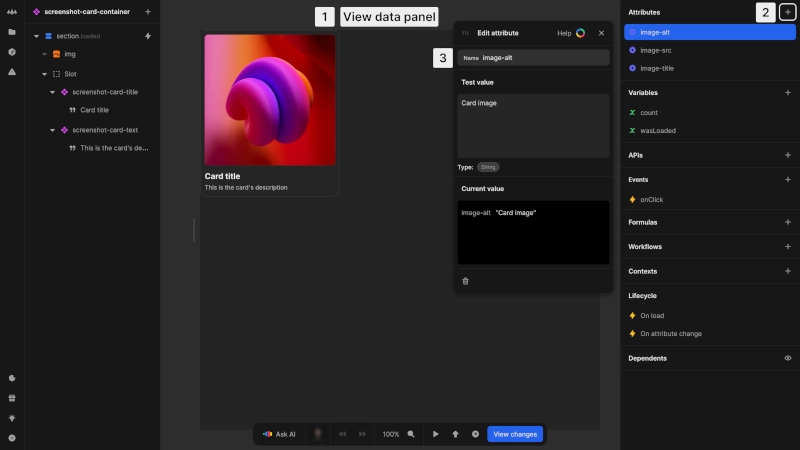
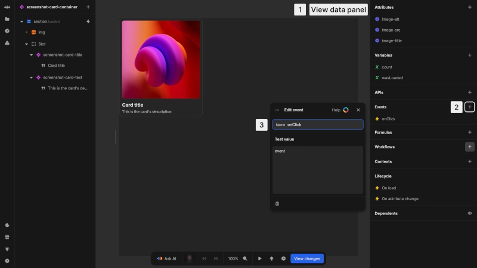
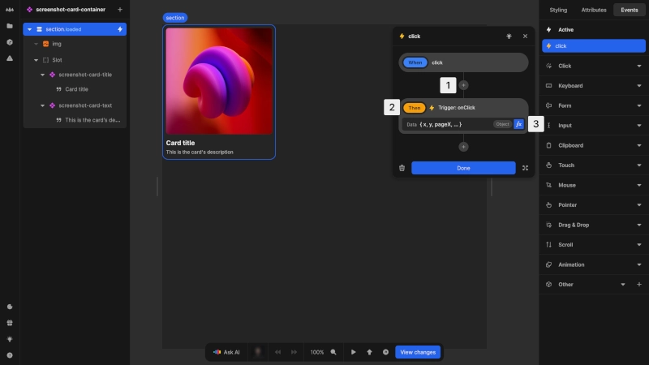
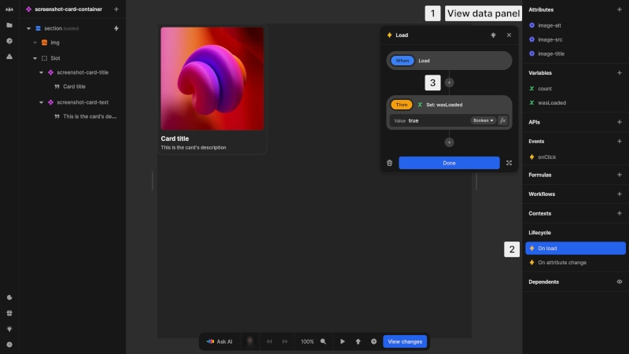

# Interface and lifecycle

Components in Nordcraft need clearly defined interfaces to interact with the rest of your application, and they follow a specific lifecycle as they are created, updated and removed from the page. Understanding component interfaces and lifecycle helps you create components that integrate seamlessly with the rest of your application and behave predictably as your application state changes.

## Component interface

The interface of a component defines how it communicates with other parts of your application. There are three communication channels

- [Attributes](#defining-attributes): Data flow into the component (input)
- [Events](#setting-up-events): Data flow out to parent components (output)
- [Contexts](#data-flow-with-contexts): Data flow between parent and any descendant components

::: tip

- Attributes pass data from parent to child
- Events pass data from child to parent
:::

### Defining attributes

{https://toddle.dev/projects/docs_examples/branches/main/components/screenshot-card-container?canvas-width=800&rightpanel=style&selection=attributes.image-alt&canvas-height=800}

Attributes are the primary way to pass data into a component:

1. Open the component and view the [data panel](/the-editor/data-panel) with no element selected
2. In the **Attributes** section, click the [kbd]+[kbd] button
3. Configure the attribute:
   - **Name**: A unique name that must consist of lowercase letters, numbers, hyphens (`-`) and underscores (`_`) only
   - **Test value**: The value used in the editor; this test value also determines the attribute type (e.g. `Number`, `String`, `Array`, etc.)

Attributes allow you to create configurable components that can:

- Alter their behavior based on the data they are passed
- Display different content or styling
- Access data fetched by parent components
- Be reused throughout your application with different configurations

For example, a **tooltip** component might use attributes to control:

- Which side of the screen the tooltip appears on (left, right, top, bottom)
- The delay before showing the tooltip
- What content appears inside the tooltip
- Whether the tooltip has a close button

::: info
Attributes can be accessed inside any formula within the component.
:::

::: info
The test value is only used while developing your component in the editor. It has no impact on how your component will behave when used in other components or pages.
:::

### Setting up events

{https://toddle.dev/projects/docs_examples/branches/main/components/screenshot-card-container?canvas-width=800&rightpanel=style&selection=events.0&canvas-height=800}

Events allow components to communicate upward to parent elements:

1. Open the component and view the [data panel](/the-editor/data-panel) with no element selected
2. In the **Events** section, click the [kbd]+[kbd] button
3. Configure the event:
   - **Name**: A descriptive name for the event
   - **Test value**: Example data that defines the event's output structure, allowing you to develop event handling in parent components without actual event triggers.

Events enable child components to send messages and data up to their parent components.

::: info
The test data is only used while developing your component. It helps when setting up workflows in parent components that will handle this event, but has no impact on your application at runtime.
:::

### Triggering events

Unlike HTML element events that trigger automatically on user interactions, component events must be explicitly triggered from within the component.

### Initial steps

- **From an element event**: Select the triggering element (e.g. a button), go to the [events tab](/the-editor/element-panel#events-tab) and find the appropriate HTML event (e.g. `click`)
- **From a workflow**: Create or edit a workflow

### Common steps

{https://toddle.dev/projects/docs_examples/branches/main/components/screenshot-card-container?canvas-width=800&canvas-height=800&selection=nodes.root.events.click&rightpanel=events}

1. Click the `+` button to add a new action
2. In **Events**, select the `Trigger: event` action for desired component event to trigger
3. Define the data payload to send with the event

::: info
All events defined in a component appear under the **Events** section when setting up event handlers.
:::

## Data flow with contexts

In addition to attributes and events, components can communicate through contexts. Contexts provide an alternative communication channel that allows components to share data and functionality across the component tree without passing through intermediaries.

::: info
For detailed information on how to use contexts, see the [Contexts](/contexts/overview) page.
:::

## Component lifecycle

Components go through several phases during their existence in your application.

### Initialization

When a component is first added to a page or another component:

1. The component is created with its default structure
2. Attribute values are applied
3. Variables are initialized with their default values
4. The `On load` event is triggered

The initialization phase is the right time to:

- Set up initial state based on attributes
- Fetch initial data from APIs
- Perform one-time setup operations

{https://toddle.dev/projects/docs_examples/branches/main/components/screenshot-card-container?canvas-width=800&rightpanel=style&selection=onLoad&canvas-height=800}

To add initialization logic:

1. With no element selected, view the [data panel](/the-editor/data-panel)
2. In the **Lifecycle** section, click on the `On load` event
3. Add actions to the `On load` event

### Attribute changes

After initialization, components respond to changes in their attributes:

1. When an attribute value changes, the `On attribute change` event is triggered
2. The component updates to reflect the new attribute values

This phase is useful for:

- Updating internal state based on new attribute values
- Triggering recalculations or updating data from API calls
- Updating the component's appearance

{https://toddle.dev/projects/docs_examples/branches/main/components/screenshot-card-container?canvas-width=800&rightpanel=style&selection=onAttributeChange&canvas-height=800}

To add attribute change logic:

1. With no element selected, view the [data panel](/the-editor/data-panel)
2. In the **Lifecycle** section, click on the `On attribute change` event
3. Add actions to the `On attribute change` event

::: info
The `On attribute change` event is always triggered when any attribute of the component is changed.
:::

### Internal state management

Components maintain their own internal state using [variables](/variables/overview). Component variables are:

- Private to the component instance
- Preserved as long as the component is on the page
- Reset when the component is removed and added again

::: info
When a component is unmounted, all its resources, including event listeners, workflows, and variable values, are automatically cleaned up. This helps prevent memory leaks in your application, which could negatively affect performance.
:::
