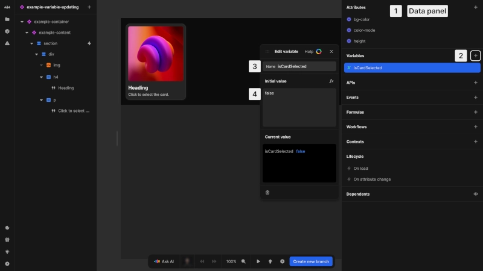

# Working with variables
Variables enable dynamic and interactive components by managing state throughout your application. This page covers the practical aspects of creating and working with variables in toddle.

Variables can be used throughout the component or page:
- **In formulas**: Reference variables directly by name
- **In workflows**: Use variables in conditions and actions
- **In elements**: Bind element properties to variables
- **In styling**: Create dynamic styles based on variable values

# Creating variables

{https://toddle.dev/projects/docs_examples/branches/main/components/card?canvas-width=800&rightpanel=style&canvas-height=800}

To create a variable:
1. Open the [data panel](/the-editor/data-panel) with no element selected
2. In the **Variables** section, click the [kbd]+[kbd] button
3. Enter a name for your variable
4. Set an [initial value](#initial-value) (can be a static value or formula)

## Initial value
When creating a variable, its default initial value is `null`. You can either keep this default or specify a different initial value:
- **Static values**: You can directly enter text, numbers, booleans, JSON objects etc.
- **Formula-based values**: Click the `fx` button to open the formula editor and create a dynamic initial value

The initial value serves several important purposes:
- Provides a starting state for your component
- Determines the implicit data type of the variable
- Ensures the variable has a known value before any user interaction

For example, initializing with:
- `0` creates a numeric variable
- `""` (empty string) creates a text variable
- `[]` creates an array variable
- `{}` creates an object variable
- `null` is the default and can be used when the actual value will be set later

::: info
When using a formula to set the initial value, you can reference attributes but not API data. This is because API data won't be available when the variable initializes.
:::

::: tip
For API-dependent variables, set an initial value like `null` and update the variable after the API call completes.
:::

# Updating variables
Variables can be updated through workflows or events:
1. In a workflow or event add a new action by clicking the [kbd]+[kbd] button
2. Select in "Variables" the `Set: variable` action for desired variable 
3. Specify the new value (static or formula)

@@@ example
componentUrl: https://docs_examples.toddle.site/.toddle/custom-element/example-variable-updating.js
editorUrl: https://toddle.dev/projects/docs_examples/branches/main/components/example-variable-updating?rightpanel=events&canvas-width=800&selection=nodes.RXXxhmSNTU21VntB7mKuh.events.click.actions.0.data&canvas-height=800
height: 18rem

See how clicking the card updates the `isCardSelected` variable.
@@@

# Binding variables
Variables can be connected to element properties through binding, allowing them to dynamically control the appearance and behavior of your components.

To bind a variable:
1. Select the element in the element tree
2. Find the property you want to bind
3. Click the `fx` button next to the property
4. In the formula editor, select your variable from the available options
5. Add any additional logic if needed (transformations, conditions, etc.)

@@@ example
componentUrl: https://docs_examples.toddle.site/.toddle/custom-element/example-variable-updating.js
editorUrl: https://toddle.dev/projects/docs_examples/branches/main/components/example-variable-updating?canvas-width=800&rightpanel=attributes&selection=nodes.RXXxhmSNTU21VntB7mKuh.classes.selected.formula&canvas-height=800
height: 18rem

See how to bind the `isCardSelected` variable to a class for the card's conditional styling.
@@@

Variables can be bound to various aspects of elements:
- Attribute values (text, src, href, etc.)
- Classes (see [conditional styling](/styling/conditional-styling#class-based-styles))
- [Show/hide functionality](/formulas/the-formula-editor) (with boolean conditions)
- [Repeat formulas](/formulas/repeat-formulas) (using arrays to generate multiple elements)
- Workflows and actions (as inputs or conditions to control logic)

## Input field binding
For `input` elements, toddle provides a convenient shortcut to create two-way binding with variables:
1. Select an input element in the element tree
2. In the Attributes tab, find the 'Bind to variable` dropdown
3. Choose an existing variable or create a new one

@@@ example
componentUrl: https://docs_examples.toddle.site/.toddle/custom-element/example-variable-input-binding.js
editorUrl: https://toddle.dev/projects/docs_examples/branches/main/components/example-variable-input-binding?canvas-width=800&mode=design&selection=nodes.Aw-ypNWnj8VwAKTg5h6vf&rightpanel=attributes&canvas-height=800
height: 5rem

See how to bind a variable to an input field.
@@@

This is a shortcut that automatically sets up:
- A binding of the variable to the input's `value` attribute
- An event handler on the `input` event that updates the variable when the user types