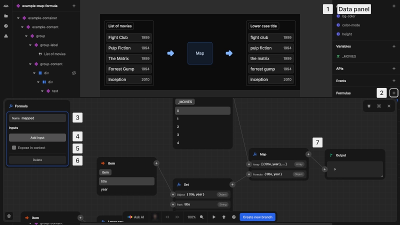

# Working with formulas
Discover how to effectively work with formulas to manipulate data and streamline logic in Nordcraft.

## Create a formula

{https://toddle.dev/projects/docs_examples/branches/main/components/example-map-formula?rightpanel=style&canvas-width=800&selection=formulas.2q0_dN&canvas-height=800}

To create a new formula in Nordcraft:
1. Navigate to the [data panel](/the-editor/data-panel) with no element selected
2. Click the [kbd]+[kbd] button in the **Formulas** section
3. Enter a name for your formula
4. (Optional) Add inputs with test values to use while developing the formula
5. (Optional) Expose the formula in context to make it available to child components
6. (Optional) Delete the formula when it is no longer needed
7. Define the formula logic using the formula editor

Test values for the inputs are particularly useful during development as they allow you to verify your formula works correctly without needing to set up actual data flows.

## Accessing data in formulas
Formulas can access various data sources within your component:
- **Inputs**: Formula-specific inputs
- **Attributes**: Values passed into the component
- **Variables**: Variables defined in the component
- **API data**: Results from API calls
- **Context values**: Data exposed by parent components
- **Component formulas**: Formulas defined in the component
- **Global formulas**: Formulas defined at the global project level

## Reusable formulas
To keep your formulas efficient and maintainable, define reusable formulas that can be referenced throughout your project. If you find yourself repeating the same formula logic in multiple places, follow these steps:
1. Create a component-level formula in the data panel
2. Give it a descriptive name
3. Define its logic once
4. Reference it wherever needed

Reusable formulas provide these benefits:
- Reduce duplication in your codebase
- Improve maintainability (changes in one place affect all usages)
- Enhance performance through result caching (due to their pure function nature)

@@@ example
componentUrl: https://docs_examples.toddle.site/.toddle/custom-element/example-reusable-formula.js
editorUrl: https://toddle.dev/projects/docs_examples/branches/main/components/example-reusable-formula?rightpanel=attributes&canvas-width=829&selection=formulas.p1pYpC&canvas-height=800
height: 26rem

Discover how a reusable formula formats the box office value, ensuring consistent formatting throughout the component wherever it is used.
@@@

### Nested formulas
In Nordcraft you can create nested formulas where one formula can call another:
- Build small, focused formulas that perform specific tasks
- Combine these smaller formulas to create more complex logic
- This modular approach makes your code more readable and easier to maintain

By breaking down complex operations into smaller, reusable pieces, you can build sophisticated functionality while keeping each formula simple and focused on a single responsibility.

@@@ example
componentUrl: https://docs_examples.toddle.site/.toddle/custom-element/example-nested-formulas.js
editorUrl: https://toddle.dev/projects/docs_examples/branches/main/components/example-nested-formulas?canvas-width=800&rightpanel=style&selection=formulas.lJzgnD&canvas-height=800
height: 26rem

Discover how this nested formula works, combining different formulas to filter 90s movies, calculate the average box office and format the result.
@@@

# Common formula examples
The formula editor supports many JavaScript-like operations, presented through Nordcraft's visual approach. Below are some common formula examples to help you get started.

## Map formula
The `Map` method creates a new array by applying a function to each element in the original array.

@@@ example
componentUrl: https://docs_examples.toddle.site/.toddle/custom-element/example-map-formula.js
editorUrl: https://toddle.dev/projects/docs_examples/branches/main/components/example-map-formula?leftpanel=design&canvas-width=800&canvas-height=800&rightpanel=style&selection=formulas.2q0_dN
height: 19rem

Check out how the `Map` formula transforms each item in an array using the `Set` function, with the results displayed in a new array.
@@@

## Filter formula
The `Filter` method creates a new array with elements that pass a specific condition.

@@@ example
componentUrl: https://docs_examples.toddle.site/.toddle/custom-element/example-filter-formula.js
editorUrl: https://toddle.dev/projects/docs_examples/branches/main/components/example-filter-formula?rightpanel=attributes&canvas-width=800&selection=formulas.2q0_dN.formula&canvas-height=800
height: 19rem

See how the `Filter` formula selects specific items from an array based on a condition, returning a new array with only the matching elements.
@@@

## Sort formula
The `Sort by` method arranges array elements in a specific order.

@@@ example
componentUrl: https://docs_examples.toddle.site/.toddle/custom-element/example-sort-formula.js
editorUrl: https://toddle.dev/projects/docs_examples/branches/main/components/example-sort-formula?canvas-width=800&rightpanel=style&selection=formulas.2q0_dN.formula&canvas-height=800
height: 19rem

Discover how the `Sort by` formula arranges items in an array based on a specified order, returning a new sorted array.
@@@

## Reduce formula
The `Reduce` method applies a function to reduce an array to a single value.

@@@ example
componentUrl: https://docs_examples.toddle.site/.toddle/custom-element/example-reduce-formula.js
editorUrl: https://toddle.dev/projects/docs_examples/branches/main/components/example-reduce-formula?rightpanel=attributes&canvas-width=800&selection=formulas.2q0_dN&canvas-height=800
height: 19rem

See how the `Reduce` formula transforms an array into a single value by applying a function to each element.
@@@

## Find formula
The `Find` formula searches through the array of items, applying the predicate formula to each item and returns the first item where the predicate formula returns `true`.

@@@ example
componentUrl: https://docs_examples.toddle.site/.toddle/custom-element/example-find-formula.js
editorUrl: https://toddle.dev/projects/docs_examples/branches/main/components/example-find-formula?rightpanel=style&canvas-width=800&selection=formulas.2q0_dN.formula&canvas-height=800
height: 19rem

The `Find` formula searches an array for the first matching element and returns it.
@@@

## Get formula
The `Get` formula extracts a value from an object, array or string at a specified path (number, string or array), returning `null` if no value is found.

@@@ example
componentUrl: https://docs_examples.toddle.site/.toddle/custom-element/example-get-formula.js
editorUrl: https://toddle.dev/projects/docs_examples/branches/main/components/example-get-formula?canvas-width=800&rightpanel=attributes&selection=formulas.2q0_dN&canvas-height=800
height: 19rem

Check out how the `Get` formula extracts a value from an object, array or string at a specified path.
@@@