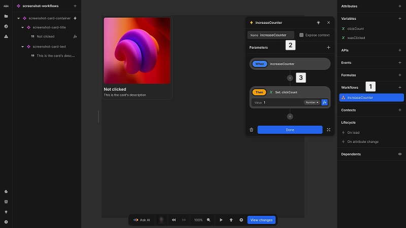
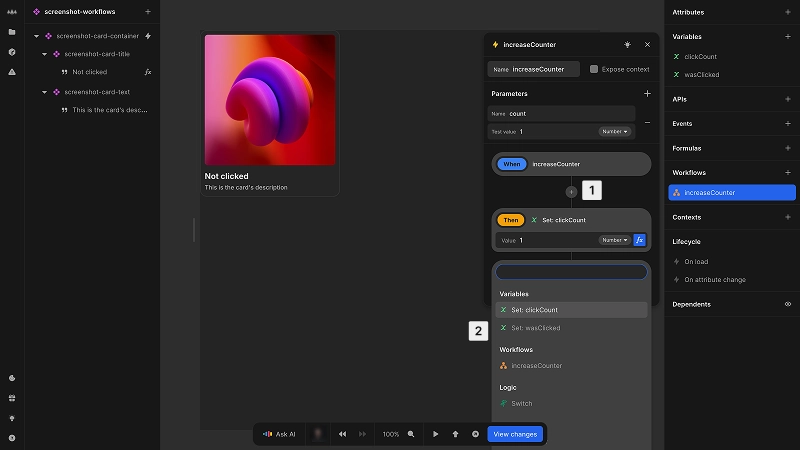

# Create a workflow
A workflow can be created on any event in toddle. This can be a standard JavaScript event on an element, a custom [event on a component](/components/interface-and-lifecycle/#setting-up-events) or lifecycle events like `On load` or `On attribute change`.

{https://toddle.dev/projects/docs_examples/branches/main/components/screenshot-workflows?canvas-width=800&selection=nodes.root.events.onClick&rightpanel=events&canvas-height=800}

To create a workflow on an event:
1. Select the event. This can be any event in toddle
2. Add [nodes](#nodes) to create your logic

# Reusable workflows
If you have logic in your component that you need multiple times or if the logic tree is complex, you can create a reusable workflow from the [data panel](/the-editor/data-panel#workflows). 

{https://toddle.dev/projects/docs_examples/branches/main/components/screenshot-workflows?canvas-width=800&rightpanel=events&selection=workflows.g1E2BN&canvas-height=800}

To create a reusable workflow:
1. Make sure you have no element selected so that you can see the data panel. Click the [kbd]+[kbd] button in the workflows section.
2. Select a name for the worflow and optionally add [parameters](#parameters-and-events)
3. Add [nodes](#nodes) to create your logic

::: tip
Create reusable workflows to keep your logic trees managable or if you need the same functionality multiple times.
:::

# Parameters and Events
When a workflow is triggered by an event, you have access to the event's data within the formulas of the workflow. That way you can react to the data of the event.

In reusable workflows, you can define parameters. These are the inputs of the workflow. You can use them in any formula in the workflow. By defining parameters, you can create workflows that can cover multiple scenarios.

To create a parameter:
1. Click the [kbd]+[kbd] button
2. Choose a name for the parameter
3. Optionally assign a test value. This value is only valid in the editor and will not affect the production app

# Nodes
Nodes are the core of workflows. A node is an action or a piece of logic that is executed sequentially. Nodes are the visual language in toddle that you use to compose the desired logic. There are several built-in nodes like `Set variable`, `Set session cookies` or `Switch`. But you can also call custom [actions](/actions/overview) or reusable workflows. This way you can create nested workflows and individual pieces of logic that are composable.

To add a node:
1. Click on a [kbd]+[kbd] icon in the workflow
2. Pick a node from the list and click on it

::: tip
You can copy and paste nodes in a workflow or between workflows via the context menu or [kbd]Cmd/Ctrl + C[kbd] and [kbd]Cmd/Ctrl + V[kbd].
:::