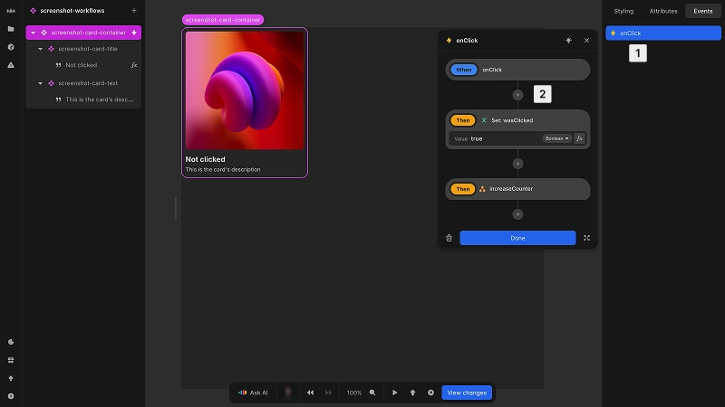
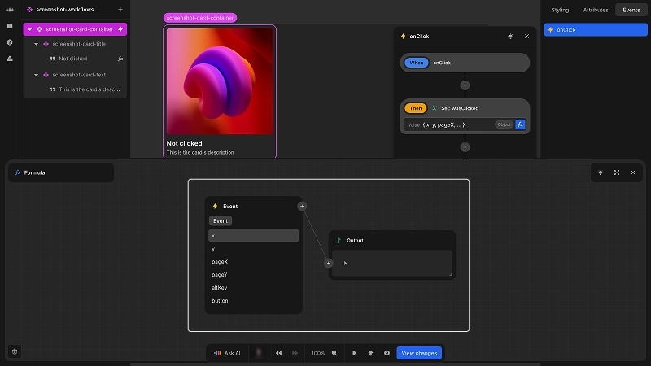
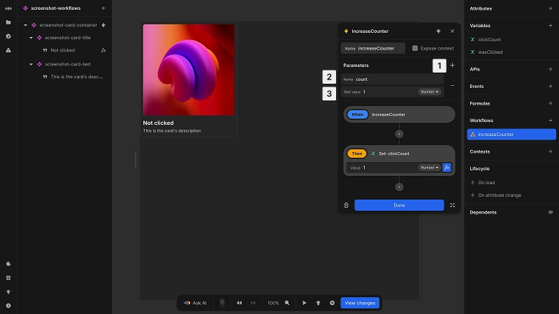

# Working with workflows

Learn how to create event-triggered and reusable workflows with parameters and sequential action nodes to implement interaction logic in your Nordcraft app.

## Create a workflow

You can create a workflown on any event in Nordcraft. This can be a standard JavaScript event on an element, a custom [event on a component](/components/interface-and-lifecycle#setting-up-events) or lifecycle events like `On load` or `On attribute change`.

{https://toddle.dev/projects/docs_examples/branches/main/components/screenshot-workflows?canvas-width=800&selection=nodes.root.events.onClick&rightpanel=events&canvas-height=800}

To create a workflow on an event:

1. Select the event; this can be any event in Nordcraft
2. Add [nodes](#nodes) to create your logic

## Reusable workflows

If you have logic in your component that you need multiple times or if the logic tree is complex, you can create a reusable workflow from the [data panel](/the-editor/data-panel#workflows).

{https://toddle.dev/projects/docs_examples/branches/main/components/screenshot-workflows?canvas-width=800&rightpanel=events&selection=workflows.g1E2BN&canvas-height=800}

To create a reusable workflow:

1. With no element selected so that you can see the data panel, click the [kbd]+[kbd] button in the workflows section
2. Select a name for the workflow and add optional [parameters](#parameters-and-events)
3. Add [nodes](#nodes) to create your workflow logic

::: tip
Create reusable workflows to keep your logic trees managable or if you need to use the same functionality multiple times.
:::

## Parameters and events

When a workflow is triggered by an event, you have access to the event's data within the formulas of the workflow, enabling you to react to the data of the event.

In reusable workflows, you can define parameters. These are the inputs of the workflow and you can use them in any formula in the workflow. By defining parameters, you can create workflows that can cover multiple scenarios.

To create a parameter:

1. Click the [kbd]+[kbd] button
2. Choose a name for the parameter
3. Assign an optional test value; this value is only available in the editor and will not affect your application in production

## Nodes

A node is an action or a piece of logic that is executed sequentially. Nodes are the visual language in Nordcraft that you use to compose the desired logic. There are several built-in nodes like `Set variable`, `Set session cookies` or `Switch`. You can also call custom [actions](/actions/overview) or reusable workflows. This way you can create nested workflows and individual pieces of logic that are composable.

To add a node:

1. Click on a [kbd]+[kbd] icon in the workflow
2. Pick a node from the list and click on it

::: tip
You can copy and paste nodes in a workflow or between workflows via the context menu or [kbd]Cmd/Ctrl + C[kbd] and [kbd]Cmd/Ctrl + V[kbd].
:::

### Sequential execution

Workflows execute their nodes sequentially. However, this does not necessarily mean each step waits for the previous one to finish completely, which is what synchronous execution would require.

### Sequential and asynchronous execution

Workflows execute nodes in the order they appear (sequential), but some nodes (like API calls) work asynchronously. This means:

- Nodes are always called in sequence (one after another)
- However, asynchronous nodes may not complete before the next node starts executing
- For asynchronous operations, you need to use callback events to handle their results

This is why some nodes have specific callback events like `On success`, `On error`, or `tick`. These callbacks allow you to define what happens after an asynchronous operation completes.
