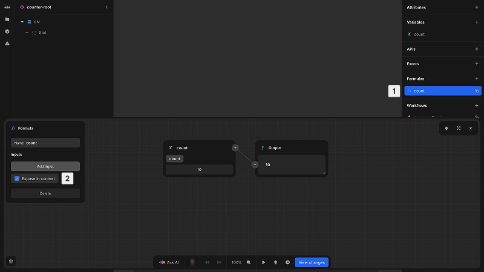
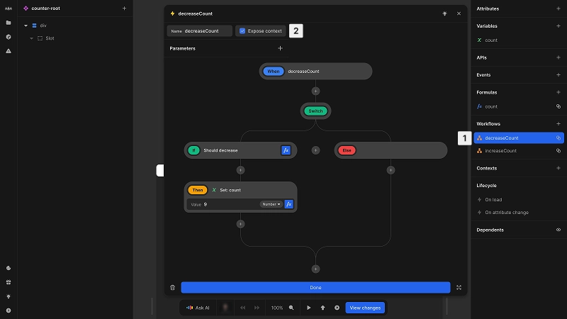
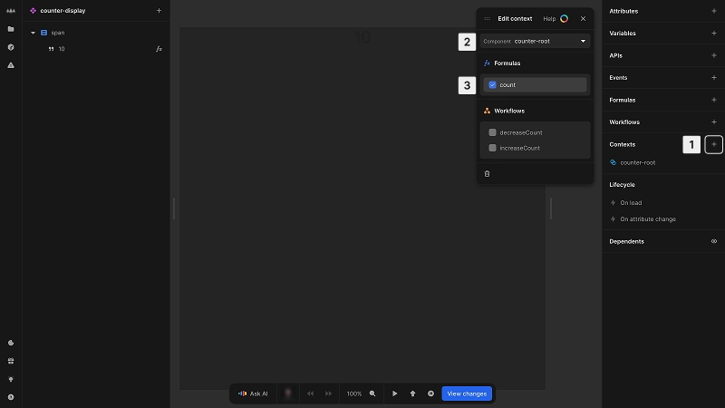

# Working with contexts
This page covers the practical aspects of creating and using contexts in Nordcraft applications. Contexts enable direct communication between ancestor and descendant components without going through intermediate components.

# Create a context provider
To create a context provider, you need to expose either formulas or workflows from a component:

## Expose a formula in context

{https://toddle.dev/projects/docs_examples/branches/main/components/counter-with-context?canvas-width=800&rightpanel=style&selection=formulas.rQmmU7&canvas-height=800}

1. In the component's [data panel](/the-editor/data-panel), navigate to the **Formulas** section and [create a new formula](/formulas/working-with-formulas#create-a-formula) or select an existing one
2. Check the [kbd]Expose in context[kbd] checkbox in the [formula-editor](/formulas/overview#the-formula-editor)

The formula will now be available to all descendant components through context.

## Expose a workflow in context

{https://toddle.dev/projects/docs_examples/branches/main/components/counter-with-context?canvas-width=800&canvas-height=800&selection=workflows.P_Trdl&rightpanel=style}

1. In the component's [data panel](/the-editor/data-panel), navigate to the **Workflows** section and [create a new workflow](/workflows/working-with-workflows) or select an existing one
2. Check the [kbd]Expose context[kbd] checkbox next to the workflow name in the details panel

The workflow can now be triggered directly by any descendant component.

::: tip
To share a variable's value through context, create a formula that returns the variable and expose it. For variable modification, create and expose a workflow that updates the variable.
:::

# Using contexts in components
Components can only access contexts from ancestors in the component tree. The context provider must be higher in the hierarchy than the component using the context.

{https://toddle.dev/projects/docs_examples/branches/main/components/counter-with-context-display?canvas-width=800&rightpanel=style&canvas-height=800}

For a component to use context from an ancestor:
1. In the selected component, navigate to the **Contexts** section in the [data panel](/the-editor/data-panel) and click the [kbd]+[kbd] button to add a context reference
2. Select the ancestor component that provides the context (Only components that expose context will appear in the list)
3. Check the specific formulas and workflows you need to access

Once added, the selected formulas and workflows become available in the component:
- Context formulas can be used in any formula editor within the component
- Context workflows can be triggered from any workflow or event handler within the component

::: info
When multiple ancestor components provide the same context, the closest ancestor takes precedence.
:::

# Example
The following example shows how to set up and use contexts with a simple counter implementation. One counter demonstrates a provider that exposes count and increment through context, while the other shows the same counter built with attribute passing for comparison.

@@@ example
componentUrl: https://docs_examples.toddle.site/.toddle/custom-element/example-contexts.js
editorUrl: https://toddle.dev/projects/docs_examples/branches/main/components/example-contexts?mode=design&canvas-width=808&rightpanel=attributes&canvas-height=800
height: 11rem

The left counter uses contexts to share count and increment function with descendant components. The right counter relies on attributes to pass this information down to child components.
@@@