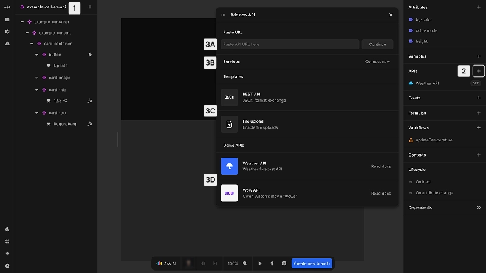
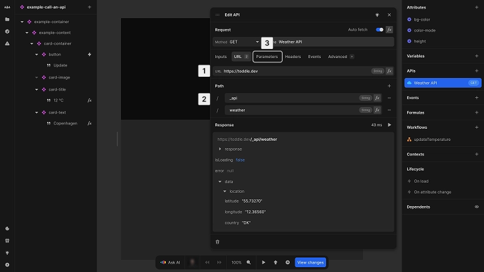
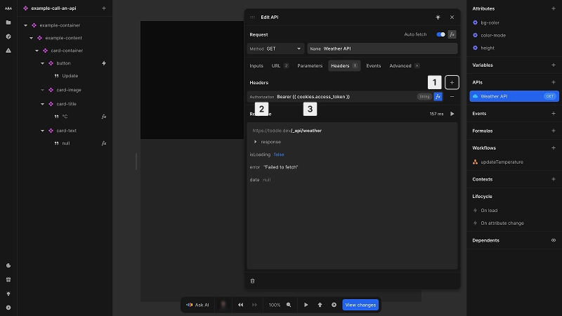

# Working with APIs
APIs are the primary way to connect your Nordcraft application to external data sources. They enable communication between your frontend application and backend services, allowing you to fetch, send and manipulate data.

# Set up a new API

To create a new API connection in Nordcraft:
1. Select the component or page where you want to add the API
2. With no element selected, go to the **APIs** section of the [data panel](/the-editor/data-panel) and click the [kbd]+[kbd] button
3. You will see the **Add new API** panel with several options:
   **(A)** Enter a URL directly to create a custom API
   **(B)** Choose from connected services to access predefined endpoints
   **(C)** Select from available templates to quickly set up common APIs
   **(D)** Choose a Demo API

For beginners, the **Demo APIs** provide an excellent starting point to understand how APIs work in Nordcraft.

::: info
Explore our blog post on [REST APIs](https://toddle.dev/blog/rest-apis-explained) if you're new to working with APIs.
:::

# Configure API requests

::: danger
missing image 
:::

After creating an API, you will see the configuration panel with several important sections:
1. **Method**: Select the appropriate [HTTP method](https://developer.mozilla.org/en-US/docs/Web/HTTP/Reference/Methods) (GET, POST, PUT, DELETE, etc.)
2. **Name**: Give your API a descriptive name for easy reference
3. **Configuration tabs**:
   - **Inputs**: Default values used with auto-fetch that can be overwritten when called from workflows
   - **URL**: Configure the base URL and path
   - **Parameters**: Configure query parameters
   - **Headers**: Set request headers for authentication, content type, etc.
   - **Body**: Define the request body for methods that support it (this tab is only visible for supported methods)
   - **Events**: Define workflows for `On success`, `On error` and `On message` events
   - **Advanced**: Access additional configuration options
4. **Response section**: View the latest response from the server
5. **Auto fetch toggle**: Control when the API automatically retrieves data

## Configure the request URL
Configure the endpoint URL to specify where your request should be sent.

The **URL** and **Parameters** tabs allow you to construct the complete request URL by configuring:
1. **Base URL**: The domain and protocol (e.g. `https://api.example.com`)
2. **Path**: The specific endpoint path (e.g. `/users/profile`)
3. **Query parameters** (in **Parameters** tab): Key-value pairs that appear after `?` in the URL. They refine the response without changing the endpoint path. Parameters with `null` values are skipped.

::: info
For a detailed explanation of URL structure, check out the [blog post about URLs](https://toddle.dev/blog/urls-how-do-they-really-work).
:::

## Set request headers
[Headers](https://developer.mozilla.org/en-US/docs/Web/API/Request/headers) provide additional information about the request that guide how the server processes the call.

To add a header:
1. In the **Headers** tab, click the [kbd]+[kbd] button
2. Select or enter the header name:
   - `Content-Type`: Format of the request body (e.g. `application/json`)
   - `Accept`: Expected format of the response (e.g. `application/json`)
   - `Authorization`: Authentication credentials (e.g. `Bearer {{ cookies.access_token }}`)
   - `Cache-Control`: Caching directives (e.g. `no-cache`)
   - `X-Api-Key`: API key for authentication
   - `Accept-Language`: Preferred language for response
3. Provide a static value or click [kbd]fx[kbd] for dynamic values

## Configure the request body
Define the data to send in the request [body](https://developer.mozilla.org/en-US/docs/Web/API/Request/body) when the method supports it, such as POST, PUT or PATCH.

::: danger
missing image 
:::

To configure the body:
1. Ensure your method supports a request body
2. Navigate to the **Body** tab
3. Use the formula editor to define the data structure

::: dev
By default, the body will be encoded as JSON unless you specify a different format using the [Content-Type](https://developer.mozilla.org/en-US/docs/Web/HTTP/Reference/Headers/Content-Type) header.
:::

## Auto fetch behavior
The auto fetch feature automatically triggers API requests based on certain conditions:
- When enabled, the API will fetch data when the component or page loads
- The API will automatically refetch when any formula values used in the request change
- This behavior can be controlled with a formula to create conditional fetching logic

Auto fetch is especially useful for GET requests where you want to display data immediately and keep it updated when related parameters change. Additionally, it enables server-side rendering (SSR) of the requested data.

## Test API requests

You can test your API directly in the editor:
1. For APIs with `Auto fetch` disabled, click the [kbd]▶[kbd] button to manually trigger the request
2. View the response in the **Response** section at the bottom of the panel
3. Check the status code, headers and body to ensure the API is working as expected
4. Check the returned data to ensure the API provides the correct information

The response section will display the data returned from the API, including properly formatted JSON if that is the response format.

# Next steps
After setting up your API, you will want to:
- [Call the API](/connecting-data/call-an-api) in response to user actions
- [Access the API data](/connecting-data/call-an-api#accessing-api-data) in your components
- Configure [authentication](/connecting-data/authentication) for secure data access
- Explore [advanced features](/connecting-data/advanced-features) for specialized requirements