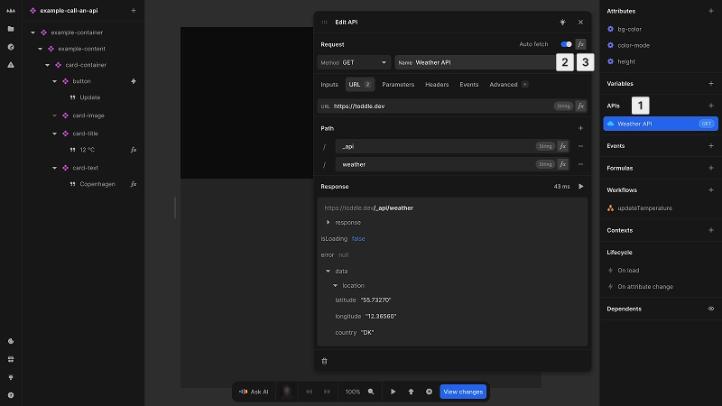
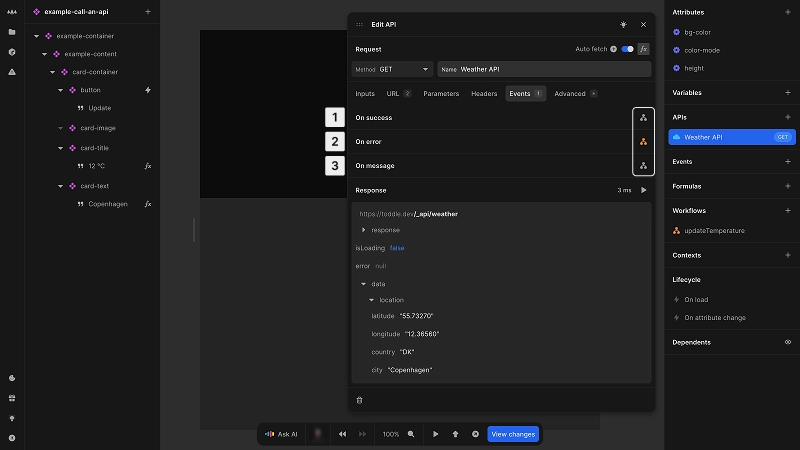

# Call an API

After [configuring an API](/connecting-data/working-with-apis), you can trigger the API call and access the returned data.

There are two ways to trigger API calls:

1. [Auto fetch](#using-auto-fetch): When auto fetch is on, your page or component will call the API on load, or when dependencies change
2. [Workflow actions](#using-workflow-actions): You can manually trigger the API from workflows

## Using auto fetch

Auto fetch automatically calls your API without requiring manual triggers. This is particularly useful for data that should be loaded immediately when a component appears.

To enable [auto fetch](/connecting-data/working-with-apis#auto-fetch-behavior):

1. Navigate to your API in the [data panel](/the-editor/data-panel)
2. Toggle **Auto fetch** on
3. Optionally use a formula for conditional data fetching

## Using workflow actions

Workflow actions give you precise control over when APIs are called, typically in response to user interactions or other events.

To call an API from a [workflow](/workflows/working-with-workflows):

1. Create or edit a workflow for an event
2. Click [kbd]+[kbd] to add an action
3. Under **APIs**, select your API
4. (Optional) Specify any input values you want to override, as defined by the API documentation

## API example

The following example demonstrates how to implement a weather card that combines both API calling methods. The example uses auto fetch to load weather data when the component mounts, and provides an update button that manually triggers the API through a workflow action.

@@@ example
componentUrl: https://docs_examples.toddle.site/.toddle/custom-element/example-call-an-api.js
editorUrl: https://toddle.dev/projects/docs_examples/branches/main/components/example-call-an-api?rightpanel=style&canvas-width=800&selection=apis.Weather%2520API&canvas-height=800
height: 21rem

This weather card displays the current temperature, and the `Update` button triggers a workflow to manually refresh the data.
@@@

## API inputs

API inputs allow you to you customize parameters each time you call an API, giving you flexibility to reuse the same endpoint with different values depending on the context.

Define inputs for your API:

1. Click [kbd]+[kbd] in the **Inputs** tab
2. Set a name
3. Set a default value, either static or dynamic using the [kbd]fx[kbd] button

When calling the API through a [workflow action](#using-workflow-actions), all defined inputs become available for overriding.

::: info
Unlike test values which are only used during development, input values serve as actual default values when the API is called with auto fetch enabled.
:::

## Handling API callbacks

Callbacks are events triggered by API responses, which let you execute specific workflows in response to updated data from an API.

Available callbacks:

1. **On success**: triggered when the API call is successful
2. **On error**: triggered when the API call fails
3. **On message**: triggered when a message is received

Set up callback handling in the **Events** section of the API or workflow action.

::: dev
Callback events on the API are executed just before the action-specific events.
:::

The following example demonstrates how to configure and react to an API callback event.

@@@ example
componentUrl: https://docs_examples.toddle.site/.toddle/custom-element/example-handle-api-callback.js
editorUrl: https://toddle.dev/projects/docs_examples/branches/main/components/example-handle-api-callback?canvas-width=800&rightpanel=events&selection=workflows.AMb8F4.actions.0.onSuccess&canvas-height=800
height: 21rem

When the weather data is successfully updated, a confetti animation is triggered as feedback.
@@@

## Accessing API data

Once your API call completes, the resulting data is available for use in your application logic and UI.

Access API response in the [formula editor](/formulas/overview#the-formula-editor):

1. In the formula editor, add a new node and select the API endpoint from the **APIs** section
2. Select the data you want to use

Available API response data:

- `isLoading`: indicates if the API call is in progress
- `data`: contains the successful API response body
- `error`: holds error information if the API call failed
- `response`: provides HTTP response details:
  - `status`: HTTP status code
  - `headers`: HTTP response headers
  - `performance`: performance metrics

::: tip
Use `isLoading` to manage UI states during data fetching (e.g. showing loading indicators or disabling interactions).
:::
