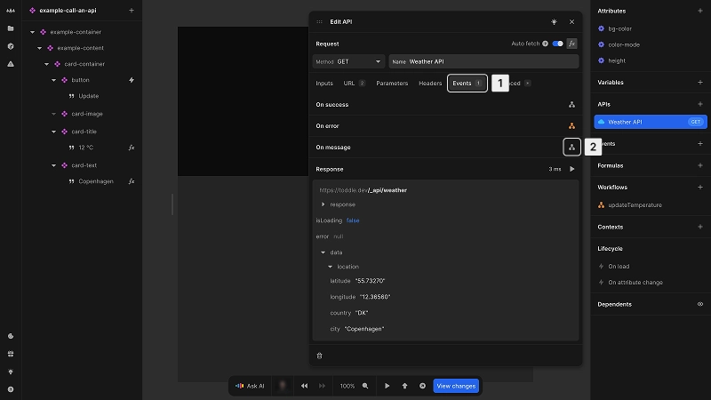
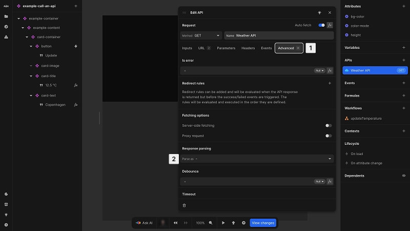

# Streaming

Streaming APIs in Nordcraft allow you to deliver data to users incrementally as it becomes available, reducing wait times and improving the user experience. When you stream data from an API, users see information as it arrives, rather than needing to wait for a complete response.

Streaming is particularly valuable when integrating AI chatbots or other systems that generate content progressively, letting users see responses as they're being created rather than waiting for the entire content to be generated on the back end before it is delivered to the front end.

## Types of streaming

Nordcraft supports two streaming formats:

- [Server-sent events](#server-sent-events) (SSE)
- [JSON streaming](#json-streaming)

### Server-sent events

Server-sent events (SSE) use the `text/event-stream` content type to establish a one-way connection where the server sends a stream of events to the client.

Each event consists of up to four fields:

- `id`: the event identifier
- `event`: the event type
- `data`: the event payload
- `retry`: time in milliseconds before reconnection attempts

When Nordcraft receives a complete event, it triggers an `On message` event with the event data. This is provided as a [CustomEvent](https://developer.mozilla.org/en-US/docs/Web/API/CustomEvent/CustomEvent) where the `detail` property contains the event fields (see above).

::: info
For detailed specifications of server-sent events, see the [HTML Living Standard](https://html.spec.whatwg.org/multipage/server-sent-events.html) specification.
:::

### JSON streaming

JSON streaming uses the `application/stream+json` or `application/x-ndjson` content type to deliver a sequence of complete JSON objects.

When Nordcraft receives a complete JSON object, it triggers an `On message` event with the parsed object as the event data. This is provided as a [CustomEvent](https://developer.mozilla.org/en-US/docs/Web/API/CustomEvent/CustomEvent) where the `detail` property contains the JSON object.

::: info
For more information about JSON streaming formats, see the [NDJSON](https://github.com/ndjson/ndjson-spec) specification.
:::

## Handling streamed data

To process streamed data in your application:

1. Navigate to the **Events** tab in your API configuration
2. Add an `On message` event handler that processes each incoming message
3. Access the message data through the event object

The structure of the data depends on the streaming type:

- For **server-sent events**, the event detail contains the event fields (`id`, `event`, `data`, `retry`)
- For **JSON streaming**, the event detail contains the parsed JSON object

## Customize response parsing

Nordcraft automatically determines how to parse streamed responses based on the `Content-Type` HTTP response header:

- `text/event-stream` is parsed as server-sent events
- `application/stream+json` or `application/x-ndjson` is parsed as JSON streaming

If your back-end service does not set the correct header, you can override the default behavior:

1. Go to the **Advanced** tab in your API configuration
2. Find the **Response parsing** section and select the appropriate option:
   - **Event stream** for server-sent events
   - **JSON stream** for JSON streaming

This forces Nordcraft to parse the response using your specified format regardless of the `Content-Type` header.

## Implementation example

A common application for streaming is with AI-powered chatbots:

- User types a question →
- API request →
- AI service starts generating a response →
- Response streams back in chunks →
- Each chunk appears in the UI as it arrives

This approach creates a more interactive experience where users do not have to wait for the complete response before seeing any output.

## Streaming guidelines

When working with streaming APIs:

- Use streaming for long-running operations where progressive updates improve user experience
- Handle partial or incomplete data appropriately in your UI
- Consider fallback behavior for users with unstable connections
- Implement appropriate error handling for interrupted streams

::: warning
Streaming connections consume resources on both client and server. For brief responses or when real-time updates aren't beneficial, standard API requests may be more efficient.
:::
