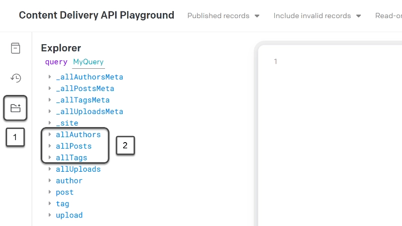
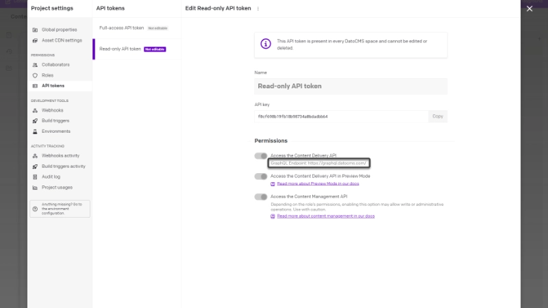
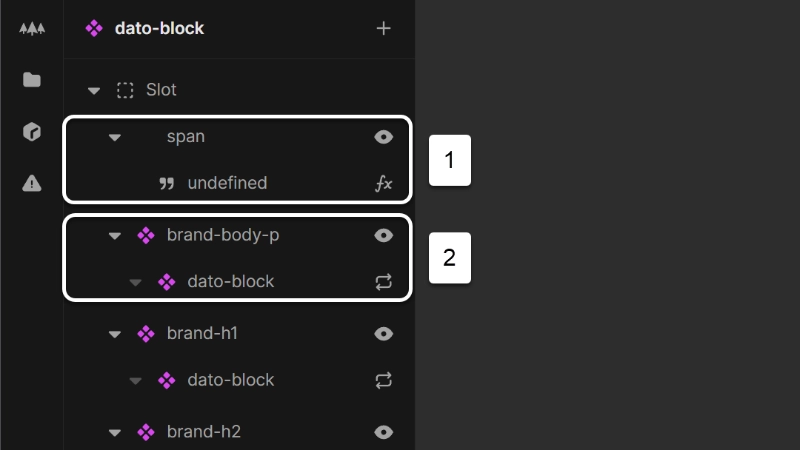
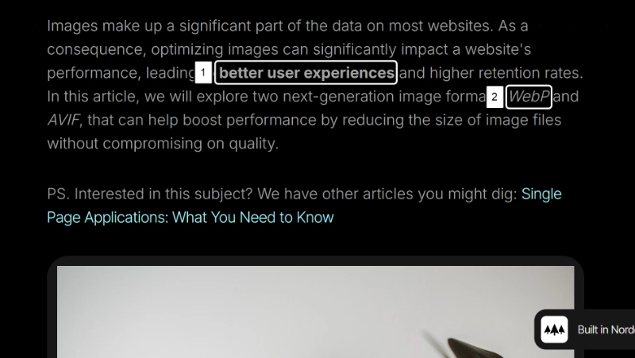

# DatoCMS Integration Guide

DatoCMS functions as a robust and intuitive headless Content Management System (CMS) that streamlines content management and delivery. This guide outlines the process of establishing a data model within DatoCMS and integrating it with Nordcraft.

### Source Projects

The projects referenced in this guide are available for cloning into your account for practical application or for independent browsing:

*   [DatoCMS Sample Project](https://dashboard.datocms.com/clone?projectId=161783&name=Nordcraft%20Sample)
*   [Nordcraft Sample Project](https://editor.nordcraft.com/projects/datocms_starter/branches/main)

## Setting up DatoCMS

Before proceeding, it is essential to understand the fundamental concepts of DatoCMS. In DatoCMS, **Models** and **Blocks** are the core of all content.

**Models** function similarly to database tables. They consist of **Fields**, which are analogous to columns, and collectively define the structure of content. Each Model provides a blueprint for creating **Records**, which are the actual content entities, such as pages, blog posts, or product listings. Models can also establish relationships by referencing other models.

**Blocks** represent dynamic and flexible components designed for embedding within Records or Models. For example, an Image Block or a Call-to-Action Block can be inserted into specific fields of a blog post Record, facilitating rich and modular content creation.

To illustrate, consider a “Blog Post” record. Its structure might include:

1. **Model:** "Blog Post"
   - **Fields:** Title, Structured Text, Author (referencing an "Author" model), Slug
2. **Blocks:** Image, Gallery, Video, Newsletter Signup CTA

(For more detailed information, consult the [DatoCMS Documentation on General Concepts](https://www.datocms.com/docs/general-concepts/data-modelling).)

## Pulling Data Into Nordcraft

Upon cloning the provided sample project into a DatoCMS account, access the project dashboard to review the data.

All posts are located under the “Content” tab within the “Blog” content category, alongside the “tags” model. These tags will be utilized to implement a simple filter in the Nordcraft project.

Under the “Schema” tab, the Models and Blocks for the project can be examined to understand their Field configurations.

Note the “Blog Post” model and note its Model ID: “posts”. This ID will be referenced later for data fetching.


The “CDA Playground” is accessible from the top right of the navigation bar. This environment allows for testing the Content Delivery API to preview data before its use within Nordcraft.

It is recommended to familiarize yourself with DatoCMS API naming conventions and data structure by exploring the “GraphQL Explorer” (1).

To begin, construct a simple query to fetch a list of blogs. The GraphQL Explorer facilitates viewing the available data types. Note the three Models in the explorer’s category list (2):



These are derived from the Model IDs mentioned previously. Adopting clean and consistent naming conventions is advised to ensure API usability.

Next, build a query to establish the blog grid. Clicking on ‘allPosts’ reveals a list of available data points for posts. A key advantage of a GraphQL API is its ability to precisely define the data to be fetched, a process made straightforward by DatoCMS's playground.

For a simple blog card, only a subset of these data points is required. Use the following query:

```
{
  allPosts(orderBy: _createdAt_DESC) {
    title
    slug
    tags {
      tag
    }
    seoTags {
      image {
        url
        alt
      }
    }
  }
}
```

This query sorts data by creation date and retrieves titles, URL slugs, associated tags, and featured images, which will be used to create a basic blog card.

To test this in a Nordcraft project, first obtain your API credentials.

From the DatoCMS dashboard, navigate to "Project Settings" in the top-right corner. Within this modal, select the "API Tokens" tab and then access the "Read-Only API Token". This token will be used for secure data retrieval in Nordcraft.

Open your Nordcraft project in a separate tab. The recommended method for setting these credentials is through global formulas, which allows for centralized updates.

[Refer to the documentation on Global Formulas for additional information.](/formulas/global-formulas)

Create a global formula for the DatoCMS Read-only API key and another for the URL, which is "**https://graphql.datocms.com/**".



### Creating our API call in Nordcraft

With the credentials configured, the first API call can be created.

On the blog page, add a JSON API and integrate the global formulas set in the previous step. The API key should be sent as an Bearer Authorization header.

::: info
Currently, the Nordcraft team is developing an enhanced UI for GraphQL calls. For the present time, data can be fetched by pasting the query into the value field of an object node.
:::

A second API call will be created for the tag filter functionality. The query for this call is:

```
{
  allTags {
    tag
  }
}
```

This provides all necessary data to create a repeating grid for blog cards and a straightforward tag filter.

While detailed design aspects are outside the scope of this guide, the blog card is typically an `<a>` tag wrapping content, using the **slug** from the API call for its `href` attribute.

Tag filter buttons are repeated based on the tags fetched in the second API call. These buttons will set a variable used to filter the repeating blog cards via the "filterByTag" formula.

The layout predominantly consists of two repeated elements, which makes it easy to modify. Components could also be created for the blog card, but for smaller projects where elements are not reused, this may not be strictly necessary. In typical development, however, building these as components is common practice.

Useful resources: [Repeating elements](formulas/repeat-formula) and [determining when to use components](guides/component-creation) in Nordcraft.

## Creating the Article Page

The article page requires two primary configurations: fetching the complete blog post data and setting up the repeating block component.

On the article page in Nordcraft, create a page parameter named **slug**.

The blog post’s slug, which serves as a unique identifier for each article, will be used to format the query.

The final query should be structured as follows:

```
{
  allPosts(filter: {slug: {eq: "nextgen-image-formats-webp-and-avif"}}) {
    title
    seoTags {
      image {
        url
        alt
      }
    }
    author {
      name
      picture {
        url
      }
      bio
    }
    _publishedAt
    content {
      blocks {
        id
        image {
          id
          alt
          url
        }
      }
      links {
        id
        slug
        title
      }
      value
    }
  }
}
```

This query retrieves the article's title, main image, author profile, and content.

Now, examine the **dato-block** component, which is a recursive component iterating over the article's content.

### Recursive Content Component

Recursive components cans sometimes be challenging to conceptualize so here is a breakdown of its structure and functionality.

To understand its setup, first review the content data:


The initial “children” array is the target for repeating the **dato-block** component. Note that its first index item also contains its own “children” array.

This structure is typical for headless CMS systems, with minor variations across platforms. The purpose of this nesting is to separate inline elements such as bold text or links as seen in the paragraph example.

::: info
Although some platforms return regular HTML, this JSON-like structure is seen more often.
:::

In the example above, the content includes regular text, bold text, another segment of regular text, and italics. These inline elements form the complete paragraph, and it is these nested children elements that the component iterates over (2).

All nested children elements share a common "value" property. This property is utilized by the first element in the dato-block component (1):



And this property is the point where the recursion ends for each item.

In summary, the "parent" **dato-block** component on the "Blog Article" page iterates over the entire article content retrieved from the API call. Subsequently, the component itself iterates over each block's children, rendering the appropriate inline elements for that block.



Given the predictable data structure from DatoCMS, a component can be configured for each element type (e.g., h1, h2, h3, p).

Once this structure is in place, the appropriate show/hide conditions are set for each block (e.g., node type equals paragraph).

Since the root of this component is a `<slot>`, the resulting HTML output remains clean, avoiding excessive nested `div` elements.


## Blocks

Finally, here is how to handle "Blocks" and blog post reference links within the data.

Examine this segment of the article API query:

```
content {
      blocks {
        id
        image {
          id
          alt
          url
        }
      }
      links {
        id
        slug
        title
      }
      value
    }
```

Note the **blocks** and **links** objects. These are defined within the blog post model's Content "Structured Text" field in DatoCMS.

They enable the injection of inline blocks such as images, videos, or galleries, as well as references to other blog posts directly within the content.

These elements are returned separately from the main content in the API call:


And are referenced within the content by their respective IDs:


Therefore, a simple filter formula can be used to assign the corresponding asset to these inline elements (e.g., images, links).

No additional repeating or recursive components are required for this configuration. The block and link data are simply passed, and the **dato-block** component manages their sorting as needed.

This concludes the guide, providing a solid foundation for web applications that integrate data from DatoCMS. An accompanying video build is coming soon.

For any questions, reach out on Nordcraft’s Discord server.

Thank you for reading, and happy building.
