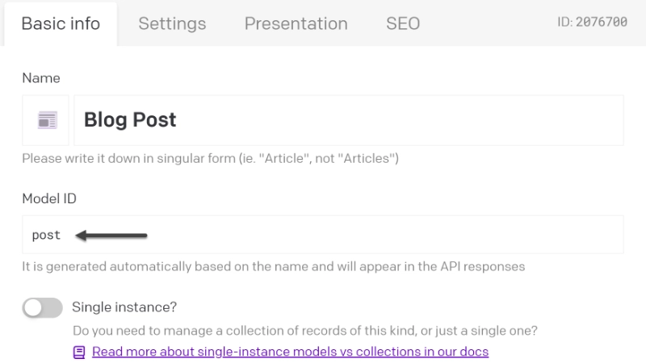
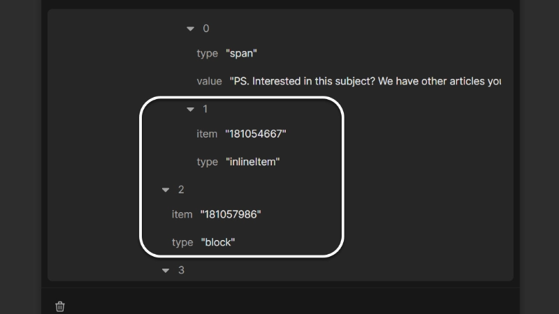

# DatoCMS Integration Guide

DatoCMS is a robust and intuitive headless Content Management System (CMS) that simplifies content management and delivery and in this guide, we'll walk through the process of creating a data model in DatoCMS and integrating it with Nordcraft.

### Source Projects

Here are the projects created in this guide. You can clone them into your accounts to follow along or browse on your own:

- [DatoCMS Sample Project](https://dashboard.datocms.com/clone?projectId=161783&name=Nordcraft%20Sample)
- [Nordcraft Sample Project](https://editor.nordcraft.com/projects/datocms_starter/branches/main)

## Setting up DatoCMS

Before we dive in, let’s go over some of the basics of DatoCMS.
In Dato, **Models** and **Blocks** form the fundamental building blocks of all content:

**Models** can be thought of as database tables, composed of **Fields** (similar to columns) that collectively define the structure of your content. These Models provide a blueprint for creating **Records**—your actual content entities like pages, blog posts, or product listings.
Models can also be referenced by other models.

**Blocks** are dynamic and flexible components that can be embedded within Records/Models. For instance, you might create an Image Block or a Call-to-Action Block that can be inserted into specific fields of a blog post Record, enabling rich, modular content creation.

To illustrate, for a “Blog Post” record, we could have:

**Model:** "Blog Post"
**Fields:** Title, Structured Text, Author (which references an “Author” model), slug
**Blocks:** Image, Gallery, Video, Newsletter Signup CTA

(For more information, check out [Dato’s Documentation on their General Concepts](https://www.datocms.com/docs/general-concepts/data-modelling).)

## Pulling Data Into Nordcraft

Once you’ve cloned our sample project into your Dato account, enter the project dashboard to see the data.
You’ll find all our posts under the “Content” tab of the navigation bar under the “Blog” content category, along with the “tags” model, we’ll be using these to set up a simple filter in our Nordcraft project.
Under the “Schema” tab, you’ll find our models and blocks—you can take a look at these to see how we set up the fields.
For now, take a look at the “Blog Post” model and notice its Model Id: “posts”, this will be important later on when we’re fetching our data:



And finally, on the top right of the navigation bar, you’ll find the “CDA Playground”.

This is where you can test your Content Delivery API to get a preview of the data we’ll be using inside Nordcraft.

I recommend playing around with the “GraphQL Explorer” (1) to get familiar with the naming conventions in Dato’s API.
Let’s start by creating a simple call to fetch a list of blogs; we’ll use the GraphQL Explorer to see the type of data we can pull.
Notice our three Models in the explorer’s category list (2):


These are set by our Model Ids mentioned above. I recommend using clean and consistent naming conventions here to keep your APIs easy to use.

Now let’s build our query to build our blog grid. Click on ‘allPosts’ and you’ll see a list of all the different data we can pull for our posts. The main strength of a GraphQL API is the ability to define exactly what data we want to fetch and DatoCMS makes this very easy to setup and preview in their playground.

For now, we’re only interested in a few of these data points. Here’s our query:

```
{
  allPosts(orderBy: _createdAt_DESC) {
    title
    slug
    tags {
      tag
    }
    seoTags {
      image {
        url
        alt
      }
    }
  }
}
```

We are sorting our data by their creation date and getting their titles, URL slugs, associated tags, and finally, their featured images.
We will use this to create a simple blog card.

Let’s go to our Nordcraft project to test it out. To do that, we’ll first need to grab our API credentials.

In your DatoCMS dashboard, head over to the top-right corner and click on “Project Settings”. In this modal, click on the “API Tokens” tab then click into your “Read-Only API Token”. We’ll use this to safely pull our data in Nordcraft.

Open up your Nordcraft project on a separate tab if you haven’t already and go into your project. The best way to set these credentials right now will be to use global formulas, that way if we need to update them in the future we only need to do so in one place.

[Check out our documentation on Global Formulas if you need a refresher.](/formulas/global-formulas)

Create a global formula for your DatoCMS Read-only API key and another one for your URL, which will be "**https://graphql.datocms.com/**".


### Creating our API call in Nordcraft

Now that we have our credentials ready, we can create our first API.

In your blog page, add a JSON API and use the global formulas that we set up in the previous step.
Send the API key as an Authorization header.

::: info
At the time of this writing, the Nordcraft team is working on an improved UI for GraphQL calls but for now we can fetch our data by pasting our query into the value field of an object node.
:::

We will also create a second API call that we’ll use for the tag filter functionality.
The query for that call is this:

```
{
  allTags {
    tag
  }
}
```

Now we have all the data we need to create a repeating grid for our blog cards as well as a simple tag filter.

We won’t go into details for the design portion of the blog but the blog card is a simple `<a>` tag wrapping the content which uses the **slug** from the API call for its href attribute.
For the tag filter buttons, we'll repeat them based on the tags fetched in our second API call. These will set a variable used to filter the repeating blog cards via the "filterByTag" formula.

As you can see, the layout is composed mostly of two repeated elements which makes it very nice to work with and update if we need to. We could even create components for the blog card as well but this is a small project and we won’t be reusing these elements anywhere else.
In a typical build, however, you’d most likely build these out as components.

Useful resources: [Repeating elements](formulas/repeat-formula) and [determining when to use components](guides/component-creation) in Nordcraft.

## Creating the Article Page

Now we’ll move on to the article page itself. There are two main things we need to do here, first is to call the full blog post data and the second is to create our repeating block component.

DatoCMS makes it easy to fetch our data. To do so, we’ll use the blog post’s slug since this is unique for each article and can function as an identifier.
In your article page in Nordcraft, create a page parameter and name it **slug**. We’ll use this parameter to format our query.

The final query should look like this:

```
{
  allPosts(filter: {slug: {eq: "nextgen-image-formats-webp-and-avif"}}) {
    title
    seoTags {
      image {
        url
        alt
      }
    }
    author {
      name
      picture {
        url
      }
      bio
    }
    _publishedAt
    content {
      blocks {
        id
        image {
          id
          alt
          url
        }
      }
      links {
        id
        slug
        title
      }
      value
    }
  }
}
```

This will fetch the article’s title, main image, the author’s profile, and its content.

Let's go over our **dato-block** component, which is a recursive component that repeats over the article’s content.

### Recursive Content Component

Recursive components can sometimes be tough to wrap our head around so let’s break it down and go over its parts.

To understand why it is setup this way, let’s first take a look at the content data:


The first “children” array is what we will repeat our **dato-block** component over but notice that its first index item also has its own “children” array.
This is a typical structure for headless CMS systems with some small variations from platform to platform. The reason for this can be seen in this paragraph and that is to separate inline elements such as bold text or links.

**Note**: Some platforms do return regular HTML but personally I’ve mostly seen this JSON type of structure used.

In the example above, we have regular text, some bold text, another set of regular text, and some italics.
All of these inline elements make up the paragraph and it’s these nested children elements that the component iterates over (2).

When creating recursive elements or workflows it can be easy to introduce an infinite loop and while this is almost a rite of passage for all developers, don’t worry, we won’t be crashing our browsers this time.

All of these nested children elements have a common point and that is the “value” property.
This is used by the first element in our dato-block component (1):


And it is the point where the recursion “ends” for this paragraph item.

So to put it all together, the “parent” **dato-block** component in our “Blog Article” page repeats over the entire article content from our API call and then the component itself iterates over each block’s children, rendering the appropriate inline elements for that block.


Since we know exactly what type of data we will be receiving from DatoCMS, we can set up a component for each element (h1, h2, h3, p, etc).
Once this structure is in place, we set the appropriate show/hide condition for each block (ie., node type equals paragraph).
And since the root of this component is a `<slot>`, we still end up with a clean HTML output instead of “divception” mess:


## Blocks

Before we wrap up, we have a couple final things to go over and those are "Blocks" and blog post reference links in our data.

Take a look at this portion of our article API query:

```
content {
      blocks {
        id
        image {
          id
          alt
          url
        }
      }
      links {
        id
        slug
        title
      }
      value
    }
```

Notice that we have **blocks** and **links** objects. These are defined in our blog post model’s Content “Structured Text” field.
These allow us to inject inline blocks such as images, videos, galleries, etc., as well as reference other blog posts inside our content.

They come in separate from the content in our API call:


And are referenced in the content by their respective ids:



So all we have to do is set up a simple filter formula to assign the corresponding asset to our inline elements (ie., images, links, etc.).

There are no additional repeating or recursive components that need to be configured for this, we just need to pass in the block and link data and let the **dato-block** component sort them as needed.

And there you have it, we now have a solid starting point for any web application pulling data from DatoCMS. There will be an accompanying video build coming soon, so stay tuned for that.

If you have any questions, you can reach out in Nordcraft’s Discord server.
Thank you for reading and have fun building ✌️
